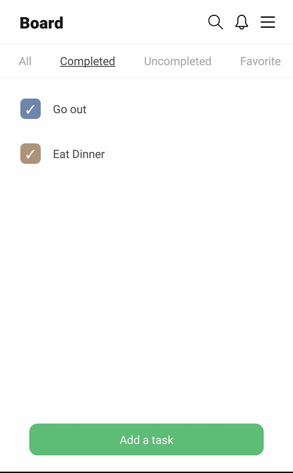

# Puzzle's Todo App Challenge

To try this app you need to first install the dependecies of the proyect
run "yarn install" or "npm install" while on the root folder
then run "expo start" to start the proyect and scan the QR Code with the Expo Go App

